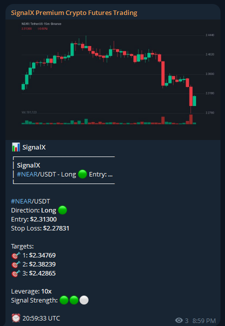
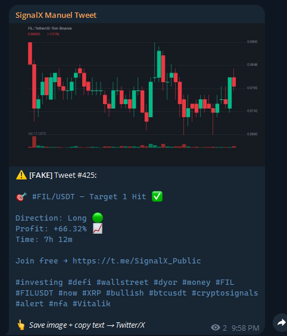
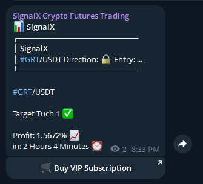
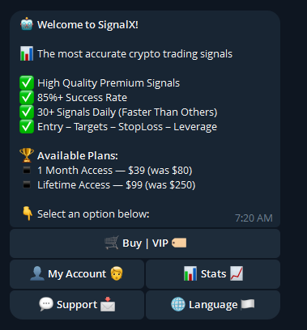

# 🤖 Crypto Trading Signal Bot

Automated cryptocurrency trading signal bot for Telegram. Uses multi-timeframe technical analysis (RSI, MACD, EMA, Bollinger Bands, Funding Rate) to generate buy/sell signals and send them to your Telegram channels with chart images.


## 📸 Screenshots

<p align="center">
  
  
</p>
<p align="center">
  
  
</p>

| Premium Signal + Chart | Auto Tweet Generator |
|:---:|:---:|
|  |  |

| Target Hit (Free Channel) | Bot /start Menu |
|:---:|:---:|
|  |  |

## ✨ Features

- 📊 **Multi-Timeframe Analysis** — 15m, 1H, 4H combined for high-accuracy signals
- 🔍 **6 Technical Indicators** — RSI, MACD, EMA, Bollinger Bands, Volume Filter, Funding Rate
- 📈 **100+ Trading Pairs** — Scans top Binance USDT pairs automatically
- 🎯 **3 Take-Profit Targets** — With stop-loss and leverage recommendations
- 📸 **Auto Chart Images** — Candlestick charts generated and sent with each signal
- 🔒 **Premium & Free Channels** — Free channel shows locked signals, premium shows full details
- 👤 **User Bot** — /start menu with VIP subscription, payments, multi-language support
- 🌐 **6 Languages** — English, Turkish, Russian, Arabic, Spanish, Chinese
- 💳 **Crypto Payments** — USDT, BTC, TRX, DOGE, LTC payment integration
- 📢 **Auto Promo** — Sends teasers and results to free channel to convert users
- 🐦 **Tweet Generator** — Auto-generates ready-to-post Twitter/X content with charts
- 📊 **Daily Reports** — Automatic performance summaries pinned to channels
- 🎯 **Signal Tracking** — Tracks target hits and calculates real profit/loss
- ⏰ **Signal Cooldown** — Prevents duplicate signals (2h cooldown per pair)
- 📉 **Trend Filter** — Only allows signals in the direction of the 4H trend

## 🏗️ Architecture

```
┌─────────────────────────────────────────┐
│           main.py (All-in-One)          │
├─────────────┬─────────────┬─────────────┤
│ Signal Bot  │  User Bot   │  Promo Bot  │
│ (Thread 1)  │  (Thread 3) │  (Thread 2) │
├─────────────┴─────────────┴─────────────┤
│  Binance API  │  Technical Analysis     │
│  Chart Gen    │  Signal Tracker         │
└─────────────────────────────────────────┘
```

## 🚀 Quick Start

### Prerequisites

- Python 3.10+
- Telegram Bot Token (from [@BotFather](https://t.me/BotFather))
- Telegram Channels (Premium + Free)

### Installation

```bash
git clone https://github.com/yourusername/crypto-trading-signal-bot.git
cd crypto-trading-signal-bot
```

**Windows (Easy — one click):**
```
Double-click BUILD.bat → installs all dependencies automatically
```

**Manual:**
```bash
pip install -r requirements.txt
```

### Configuration

Edit `config.py` with your settings:

```python
TELEGRAM_BOT_TOKEN = "your-bot-token-from-botfather"
PREMIUM_CHANNEL_ID = "-100xxxxxxxxxx"
FREE_CHANNEL_ID = "@YourFreeChannel"
ADMIN_USER_ID = 123456789
```

### Run

**Windows:**
```
Double-click START.bat
```

**Manual:**
```bash
python main.py
```

One command runs all 3 bots simultaneously (Signal + User + Promo).

## 📊 Technical Indicators

| Indicator | Purpose |
|-----------|---------|
| RSI (14) | Overbought/Oversold detection |
| MACD (12/26/9) | Momentum & crossover signals |
| EMA (9/21/50) | Trend direction & crossovers |
| Bollinger Bands (20,2) | Volatility & price extremes |
| Volume Filter | Filters low-volume false signals |
| Funding Rate | Contrarian crowd sentiment |

## 📁 Project Structure

```
crypto-trading-signal-bot/
├── main.py                 # All-in-one launcher (runs everything)
├── config.py               # Configuration (tokens, channels, settings)
├── advanced_analysis.py    # Multi-timeframe analysis engine
├── technical_analysis.py   # RSI, MACD, EMA calculations
├── binance_api.py          # Binance public API (no key needed)
├── telegram_bot.py         # Signal formatting & sending
├── user_bot.py             # /start menu, VIP, payments, languages
├── promo_bot.py            # Free channel teasers & promos
├── signal_tracker.py       # Track target hits & P/L
├── chart_image.py          # Candlestick chart generator
├── fake_stats.py           # Display stats for users
├── hashtags.py             # Auto-generate hashtags for tweets
├── requirements.txt        # Python dependencies
├── BUILD.bat               # One-click dependency installer (Windows)
├── START.bat               # One-click bot launcher (Windows)
└── images/                 # Screenshots for README
```

## ⚙️ Configuration Options

| Setting | Default | Description |
|---------|---------|-------------|
| `SCAN_INTERVAL_SECONDS` | 600 | How often to scan (seconds) |
| `SIGNAL_COOLDOWN` | 7200 | Cooldown per pair (seconds) |
| `TAKE_PROFIT_PERCENT` | 3.0% | Take profit target |
| `STOP_LOSS_PERCENT` | 1.5% | Stop loss level |
| `MIN_SIGNAL_STRENGTH` | 2 | Min indicators that must agree (1-3) |
| `FREE_CHANNEL_DELAY` | 3600 | Delay before posting to free channel |

## 🔧 How It Works

1. **Scan** — Every 10 minutes, scans 100+ pairs on Binance
2. **Analyze** — Multi-timeframe analysis (15m + 1H + 4H) with weighted scoring
3. **Filter** — Volume filter + Trend filter removes false signals
4. **Signal** — If score exceeds threshold, generates BUY/SELL signal
5. **Chart** — Creates candlestick chart image automatically
6. **Send** — Sends full signal to Premium, locked version to Free channel
7. **Track** — Monitors price for target hits and calculates profit
8. **Report** — Daily summary with win rate pinned to channels

## 📱 Bot Commands

| Command | Description |
|---------|-------------|
| `/start` | Main menu (plans, account, stats) |
| `/admin` | Admin panel |
| `/addvip <user_id>` | Grant VIP access |
| `/rmvip <user_id>` | Remove VIP access |
| `/users` | List all users |
| `/viplist` | List VIP members |
| `/realstats` | Real signal statistics |

## 🌐 Supported Languages

| Language | Code |
|----------|------|
| 🇬🇧 English | `en` |
| 🇹🇷 Türkçe | `tr` |
| 🇷🇺 Русский | `ru` |
| 🇸🇦 العربية | `ar` |
| 🇪🇸 Español | `es` |
| 🇨🇳 中文 | `zh` |

## ⚠️ Disclaimer

This bot is for **educational purposes only**. Cryptocurrency trading carries significant risk. Past performance does not guarantee future results. Always do your own research (DYOR). The developers are not responsible for any financial losses.

## 📄 License

MIT License — free to use, modify, and distribute.

## ⭐ Support

If you find this useful, please give it a ⭐ — it helps others discover the project!
